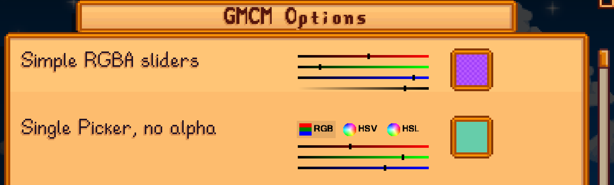
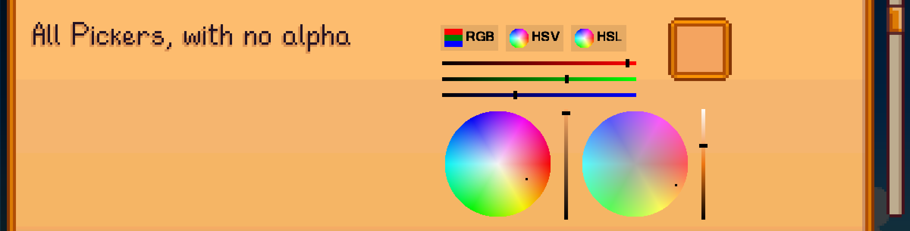

# Stardew Valley GMCM Options

A Stardew Valley SMAP mod that provides additional complex option types for use with Gemeric Mod Config Menu (GMCM).

Currentlly, the only complex option type provided is a color picker.

You can find this mod on [Nexus Mods](https://www.nexusmods.com/stardewvalley/mods/10505)
if you prefer.

## How to Use

**For end users:** Mod authors must code their mods to use GMCM Options (much like they had to code their mods to use GMCM).
There is nothing for you to do except install GMCM Options like every other SMAPI mod.

**For mod authors:**

Copy the [API](StardewGMCMOptions/IGMCMOptionsAPI.cs) into your project.
Use GMCM as normal.  When you want to insert one of the complex options provided by GMCM Options, call the appropriate
method from the GMCM Options API.  That's it!

See [Example.cs](StardewGMCMOptions/Example.cs) for a working example.

## Complex Options Provided by GMCM Options

### Color Picker

The color picker option supports choosing colors with or without an Alpha (transparency) channel in any of the following
styles:
* RGB sliders
* HSV color wheel
* HSL color wheel

An option can be a single picker style:

Or display multiple picker styles at once:

When multiple styles are shown for the same option, updates are synchronized between all of the different picker
styles.

----
## See also
* [Release Notes](doc/ReleaseNotes.md)
